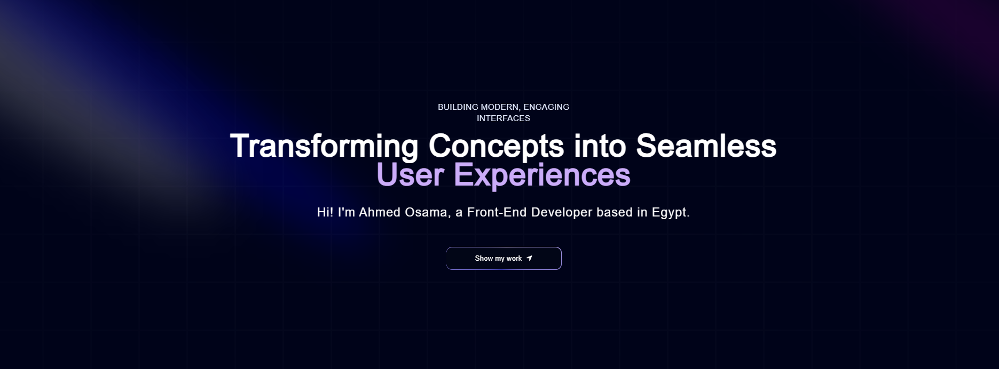

<div align="center">
  <br />
      
  <br />

  <div>
    
    
    
    

  </div>

<h3 align="center">Portfolio</h3>

</div>

## 📋 <a name="table">Table of Contents</a>

1. 🤖 [Introduction](#introduction)
2. ⚙️ [Tech Stack](#tech-stack)
3. 🤸 [Quick Start](#quick-start)

## <a name="introduction">🤖 Introduction</a>

Hi there! 👋 I'm Ahmed Osama, a passionate front-end developer specializing in React, Next.js, and TypeScript. I love crafting seamless user experiences and have worked on projects ranging from SaaS platforms to blog systems. Explore my portfolio to see my work and skills in action!

Feel free to connect or collaborate! 🚀

## <a name="tech-stack">⚙️ Tech Stack</a>

-   React 18
-   Next.js 14
-   Sanity
-   TailwindCSS
-   TypeScript

## <a name="quick-start">🤸 Quick Start</a>

Follow these steps to set up the project locally on your machine.

**Prerequisites**

Make sure you have the following installed on your machine:

-   [Git](https://git-scm.com/)
-   [Node.js](https://nodejs.org/en)
-   [npm](https://www.npmjs.com/) (Node Package Manager)

**Cloning the Repository**

```bash
git clone https://github.com/ahmedosamaaa/Portfolio.git
cd
```

**Installation**

Install the project dependencies using npm:

```bash
npm install
```

**Set Up Environment Variables**

Create a new file named `.env.local` in the root of your project and add the
following content:

```env
NEXT_PUBLIC_SANITY_PROJECT_ID=
NEXT_PUBLIC_SANITY_DATASET=
```

Replace the placeholder values with your actual Sanity credentials. You can
obtain these credentials by signing up & creating a new project on the
[Sanity website](https://www.sanity.io/).

**Running the Project**

```bash
npm run dev
```

Open [http://localhost:3000](http://localhost:3000) in your browser to view the
project.
